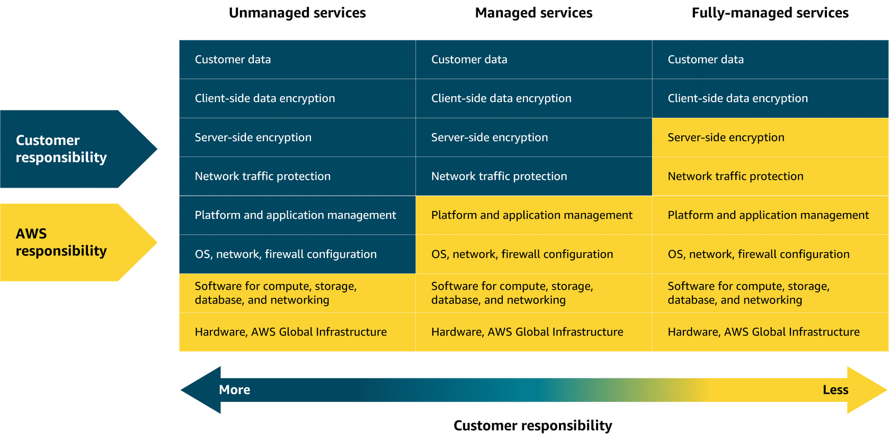
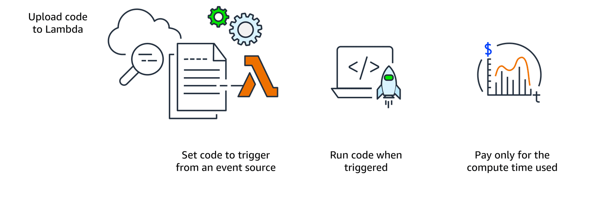

# Lecture: AWS Lambda

## Overview

Lambda is a serverless compute service that runs code in response to events without the need to provision or manage servers. It automatically manages the underlying infrastructure, scaling resources based on the volume of requests. You are charged only for the compute time consumed, down to the millisecond. Lambda handles execution, scaling, and resource allocation. You can optimize performance by configuring the appropriate memory size for your function.

## Key Concepts

### Serverless

- Unmanaged services: AWS takes care of the underlying physical infrastructure, but you're responsible for setting up, securing, and maintaining the operating system, network configurations, and applications on your instances. (e.g., EC2, RDS, etc.)

- Managed services: AWS handles much of the operational overhead, you might still need to perform some provisioning or configuration depending on the service.

- Fully-managed services: AWS takes care of everything, including provisioning, scaling, and maintenance. You can focus entirely on writing and deploying code. (e.g., Lambda, DynamoDB, etc.)

**Serverless** services are fully-managed.

### How Lambda Works

