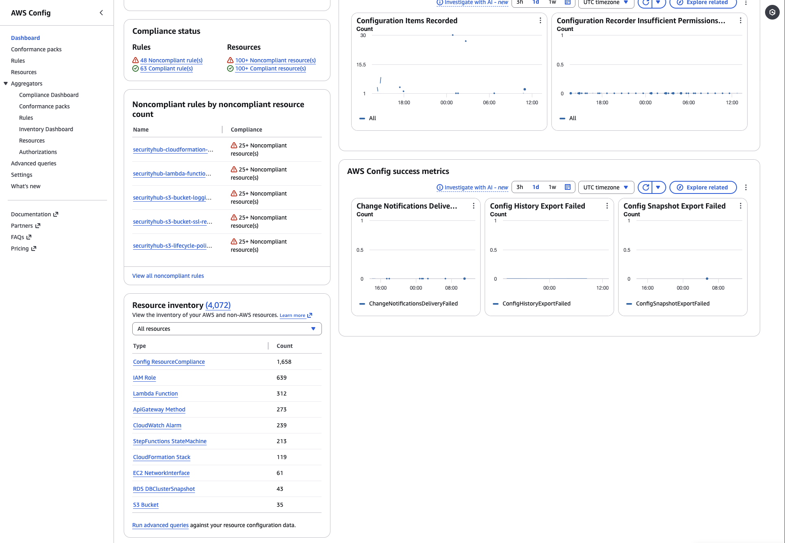

# Lecture: Compliance

## Key Concepts

### What is Compliance

Compliance refers to your cloud resources and data adhering to relevant regulations, industry standards, and internal policies regarding security and data protection.

### AWS Artifact

AWS Artifact provides no-cost, on-demand access to AWS's compliance reports and security and compliance documentation. It helps you manage your compliance requirements by providing access to AWS's certifications and attestations.

- AWS Artifact Reports: Access AWS's audit reports, such as SOC reports, PCI DSS reports, and ISO certifications.
- AWS Artifact Agreements: Review and accept AWS's compliance agreements, such as the Business Associate Addendum (BAA) for HIPAA compliance.

These only cover AWS's compliance, not your own. You are responsible for ensuring that your use of AWS services complies with relevant regulations and standards.

### AWS Config

AWS Config is a service that enables you to assess, audit, and evaluate the configurations of your AWS resources.
