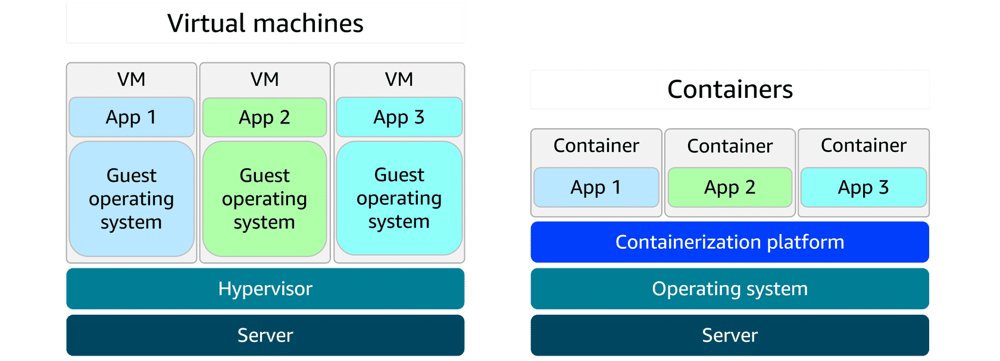

# Lecture: Container and Orchestration Services

## Key Concepts

### Containers and VMs

- A container packages your application with everything it needs to run, so it works the same on any computer.
- Containers are faster and lighter than virtual machines (VMs) because they share the host computer’s operating system. VMs use a hypervisor to run full, separate operating systems, which makes them less resource-efficient and have longer startup times.

**Serverless** services are fully-managed.

### Orchestration

As containerized applications scale, managing them becomes more complex. A setup that began with a few containers on a single host can quickly grow into hundreds or thousands of containers across multiple hosts. At that scale, manually handling container lifecycle, monitoring, and general operations becomes unsustainable. This is where orchestration tools come in. They automate deployment, scaling, and management to keep everything running smoothly.

### Amazon ECS

- Amazon Elastic Container Service (Amazon ECS) is a scalable container orchestration service for running and managing containers on AWS.

### Amazon EKS

- Amazon Elastic Kubernetes Service (Amazon EKS) is a fully managed service for running Kubernetes on AWS.

### Amazon ECR

- Amazon Elastic Container Registry (Amazon ECR) is where you can store, manage, and deploy container images. It supports container images that follow the Open Container Initiative (OCI) standards.

### Fargate

- AWS Fargate is a serverless compute engine for containers. It works with both Amazon ECS and Amazon EKS. Fargate is a container hosting platform, unlike Amazon ECS and Amazon EKS, which are both container orchestration services.
