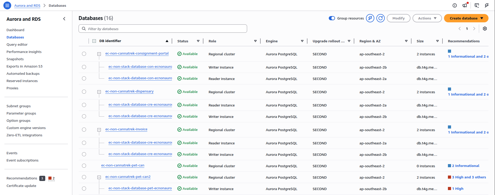

# Lecture: Databases

## Key Concepts

### RDS (Relational Database Service)

Amazon Relational Database Service (Amazon RDS) is a web service that makes it easier to set up, operate, and scale a relational database in the cloud.
Amazon Aurora is a fully managed relational database **engine** that's built for the cloud and compatible with MySQL and PostgreSQL. Amazon Aurora is part of Amazon RDS.

Cluster - a group of database instances that share the same storage.
Writer Instance - the main database node that handles all write operations and can also handle read operations.
Reader Instance - a read-only replica of the writer instance that can handle read operations to offload traffic from the writer instance.

### DynamoDB (NoSQL Database)

Amazon DynamoDB is a fully managed NoSQL database service that provides fast and predictable performance with seamless scalability. You can use Amazon DynamoDB to create a database table that can store and retrieve any amount of data, and serve any level of request traffic. Amazon DynamoDB automatically spreads the data and traffic for the table over a sufficient number of servers to handle the request capacity specified by the customer and the amount of data stored, while maintaining consistent and fast performance.

### Amazon ElastiCache

An in-memory cache is a high-speed storage layer that temporarily stores frequently accessed data in a computer's main memory, or RAM. Retrieving data from RAM provides extremely fast processing and retrieval speeds, often hundreds or thousands of times faster than traditional disk-based storage systems.

In-memory caches are ideal for storing session data, API responses, database query results, and other information that applications require repeatedly.

ElastiCache is a fully managed in-memory caching service that was built to help reduce the complexity of administering in-memory caching systems. This means that you can continue to use the same Redis, Valkey, or Memcached tools and configurations to scale your workloads.

### Amazon DocumentDB

| Feature            | **Amazon DocumentDB**                                 | **Amazon DynamoDB**                              |
| ------------------ | ----------------------------------------------------- | ------------------------------------------------ |
| **Type**           | Document database (MongoDB-compatible)                | NoSQL key-value & wide-column database           |
| **Data Model**     | JSON-like documents (BSON)                            | Key-value pairs + attributes                     |
| **Query Language** | MongoDB query API                                     | Custom API (no SQL; uses PartiQL optionally)     |
| **Schema**         | Flexible (schema-less)                                | Flexible (schema-less)                           |
| **Performance**    | Good for document queries, joins limited              | Extremely fast, single-digit ms latency          |
| **Scalability**    | Scales reads with replicas                            | Fully serverless, auto-scales reads & writes     |
| **Storage**        | Cluster-based, shared storage                         | Fully managed distributed storage                |
| **Transactions**   | Supported (multi-document, limited)                   | Supported (ACID transactions)                    |
| **Indexing**       | Secondary indexes supported                           | Primary key + secondary indexes (LSI, GSI)       |
| **Use Case**       | Apps using MongoDB (content, catalogs, user profiles) | High-scale apps (gaming, IoT, real-time systems) |
| **Consistency**    | Eventual (stronger options limited)                   | Strong or eventual consistency options           |
| **Serverless**     | No (instance-based)                                   | Yes (fully serverless)                           |
| **Cost Model**     | Instance + storage + I/O                              | Pay-per-request or provisioned throughput        |

### AWS Backup

AWS Backup is a fully managed service that lets you centrally automate and manage backups of your AWS resources.

Instead of configuring backups separately for each service (RDS, EBS, DynamoDB, etc.), AWS Backup gives you one place to control everything.

### Amazon Neptune

Amazon Neptune is a fully managed graph database service that makes it easy to build and run applications that work with highly connected datasets.
