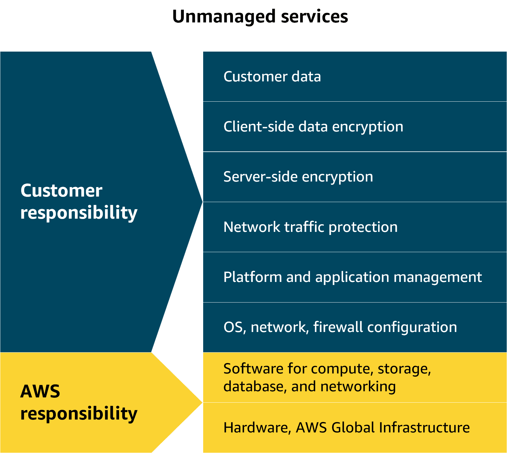

# Lecture: Introduction to EC2

## Overview

EC2 (Elastic Compute Cloud) is a web service that provides resizable compute capacity in the cloud. It allows you to run virtual servers, known as instances, on demand. EC2 offers a wide range of instance types optimized for different use cases, such as general-purpose, compute-optimized, memory-optimized, and storage-optimized instances.

## Key Concepts

### 5 EC2 instance types

| Instance Type | Category            | Key Strength         | Typical Use Cases                     | Example Family |
| ------------- | ------------------- | -------------------- | ------------------------------------- | -------------- |
| General       | Balanced            | CPU + Memory balance | Web servers, small databases, apps    | T3 / M5        |
| Compute       | Compute Optimized   | High CPU performance | Batch processing, gaming servers, HPC | C5 / C6g       |
| Memory        | Memory Optimized    | Large RAM            | In-memory DBs, analytics, caching     | R5 / X1        |
| Storage       | Storage Optimized   | Fast disk I/O        | Data warehousing, NoSQL, big data     | I3 / D2        |
| GPU           | Accelerated Compute | GPU processing power | Machine learning, video rendering, AI | P3 / G4        |

### 3 ways to access AWS APIs

| Method                 | What It Is                                 | Ease of Use  | Best For                                  | Example Use                           |
| ---------------------- | ------------------------------------------ | ------------ | ----------------------------------------- | ------------------------------------- |
| AWS Management Console | Web-based graphical interface (browser)    | Very Easy ✅ | Beginners, quick setup, visual management | Launch EC2 via browser                |
| AWS CLI                | Command-line tool to interact with AWS     | Moderate ⚖️  | Automation, scripting, developers         | Run `aws ec2 start-instances`         |
| AWS SDK                | Programming libraries (Python, Java, etc.) | Advanced 🔧  | Building applications, full automation    | Write Python code to create S3 bucket |

### Responsibility

### Pricing

| Pricing Option      | Description                                                   | Cost Level 💰  | Flexibility 🔄 | Best For                                 |
| ------------------- | ------------------------------------------------------------- | -------------- | -------------- | ---------------------------------------- |
| On-Demand           | Pay per second/hour with no commitment                        | High ❌        | Very High ✅   | Short-term, unpredictable workloads      |
| Reserved Instances  | Commit to 1 or 3 years for discounted pricing                 | Low ✅         | Low ❌         | Steady, predictable workloads            |
| Savings Plans       | Commit to a usage amount ($/hour) for 1 or 3 years            | Low ✅         | Medium ✅      | Flexible long-term usage across services |
| Spot Instances      | Use unused AWS capacity at big discounts (can be interrupted) | Very Low ✅✅  | Low ❌         | Fault-tolerant, batch jobs               |
| Dedicated Hosts     | Physical servers dedicated to you                             | Very High ❌❌ | Low ❌         | Compliance, licensing requirements       |
| Dedicated Instances | Instances on dedicated hardware (not shared with others)      | High ❌        | Medium ❌      | Isolation without full host control      |
