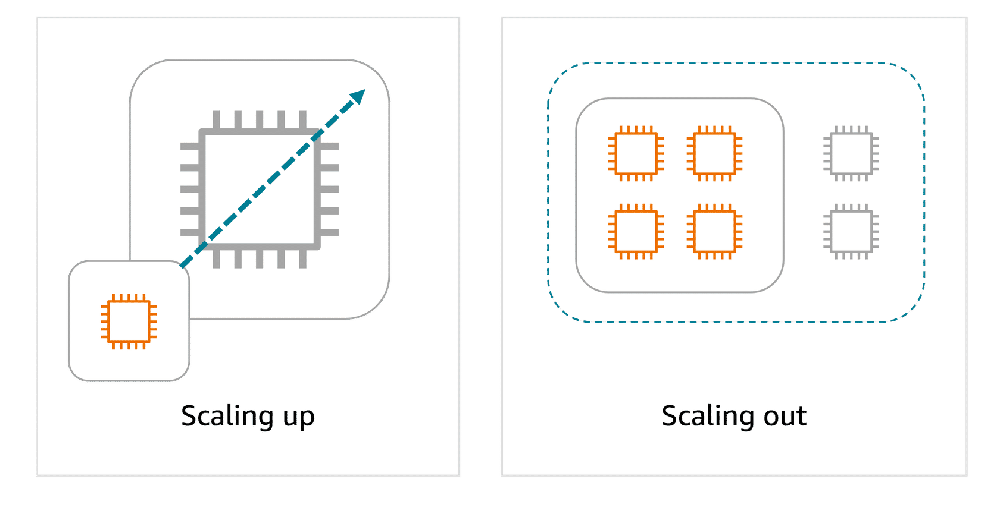
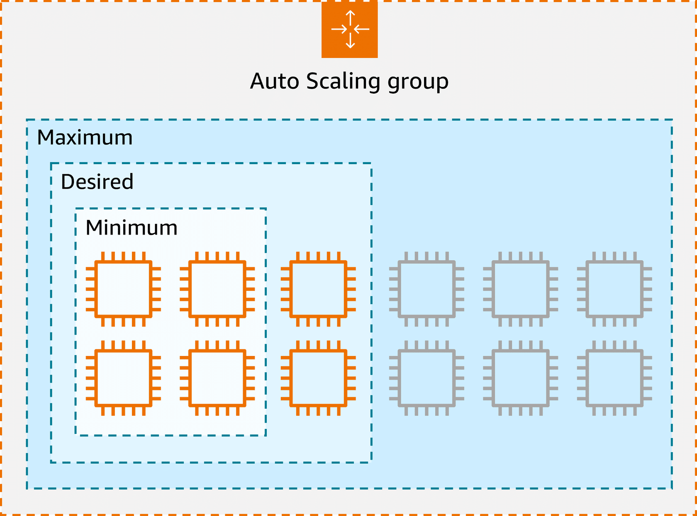
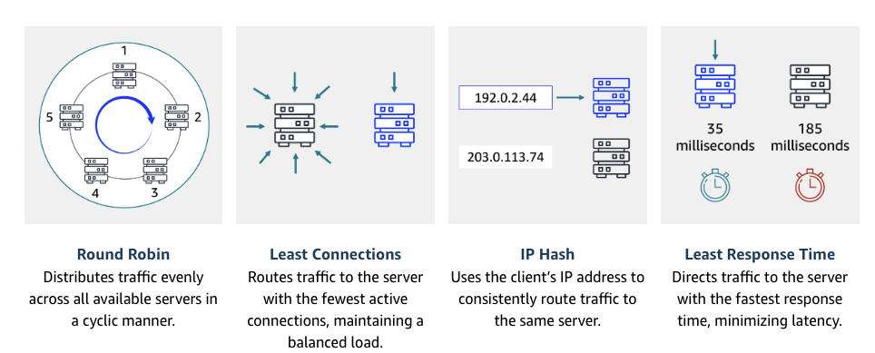

# Lecture: EC2 Scaling and Load Balancing

## Detailed Notes

### Scalability

- Vertical Scaling (Scaling Up): Increasing the resources (CPU, RAM) of an existing instance. Simple but has limits and downtime.
- Horizontal Scaling (Scaling Out): Adding more instances to distribute the load. More complex but offers better performance and fault tolerance.

### Elasticity

Elasticity is the ability to automatically scale resources up or down in response to real-time demand. A system can then rapidly adjust its resources, scaling out during periods of high demand and scaling in when the demand decreases.

### Auto Scaling

- Dynamic Scaling: Automatically adjusts the number of EC2 instances based on demand using scaling policies.
- Predictive Scaling: Uses machine learning to predict future traffic and scales resources in advance.

### Load Balancing

Elastic Load Balancing (ELB) automatically distributes incoming application traffic across multiple resources, such as EC2 instances, to optimize performance and reliability. A load balancer serves as the single point of contact for all incoming web traffic to an Auto Scaling group.

### Routing Methods

### Decoupling services

Monolithic applications: All components are tightly integrated and run as a single service. If one component fails, the entire application can be affected.

Microservices architecture: The application is broken down into smaller, independent services that communicate over APIs. To help different parts of an application communicate effectively in the clound, we can use:

- EventBridge: EventBridge is a serverless service that helps connect different parts of an application using events, helping to build scalable, event-driven systems. With EventBridge, you route events from sources like custom apps, AWS services, and third-party software to other applications. EventBridge simplifies the process of receiving, filtering, transforming, and delivering events, so you can quickly build reliable applications.
- SQS: Amazon Simple Queue Service (SQS) is a message queuing service that facilitates reliable communication between software components. It can send, store, and receive messages at any scale, making sure messages are not lost and that other services don't need to be available for processing. In Amazon SQS, an application places messages into a queue, and a user or service retrieves the message, processes it, and then removes it from the queue.
- SNS: Amazon Simple Notification Service (SNS) is a publish-subscribe service that publishers use to send messages to subscribers through SNS topics. In Amazon SNS, subscribers can include web servers, email addresses, Lambda functions, and various other endpoints.
