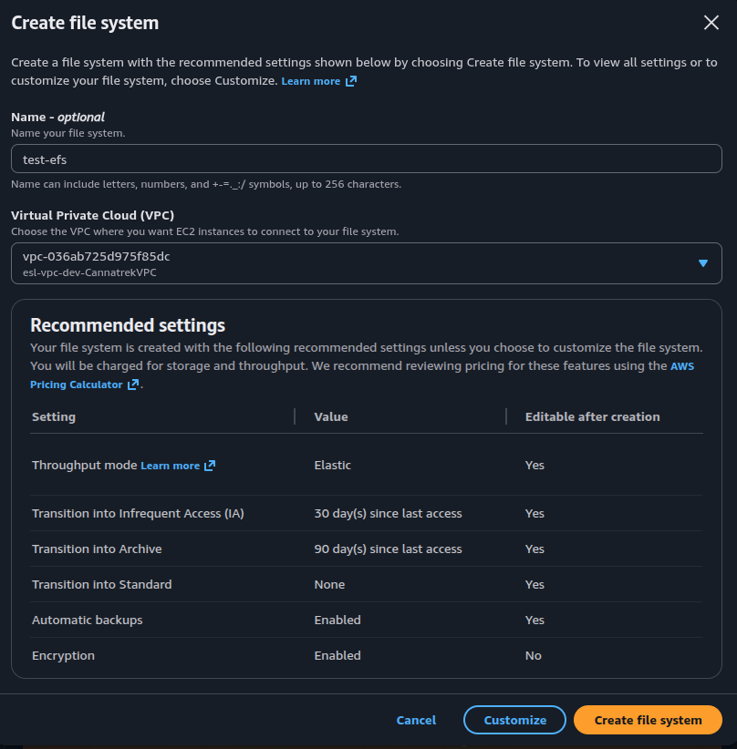

# Lecture: File Storage (EFS)

## Key Concepts

### EFS (Elastic File System)

Amazon EFS is a fully managed, scalable file storage service for use with AWS cloud services and on-premises resources. It operates using the Linux Network File System (NFS) protocol, and automatically scales to petabytes as you add or remove files without disrupting applications. EFS is designed to support a wide variety of workloads and can be accessed by multiple EC2 instances simultaneously.

Benefits:

- Multi-AZ redundancy
- Shared access
- Elastic storage

### EFS storage classes

- **Standard**: The EFS Standard and EFS Standard-Infrequent Access (Standard-IA) storage classes offer Multi-AZ resilience and the highest levels of durability and availability. They have a higher cost associated with them due to higher availability and durability.
- **One zone**: The EFS One Zone and EFS One Zone-Infrequent Access (EFS One Zone-IA) provide additional savings by saving your data in a single Availability Zone. By using just one Availability Zone, you can reduce your storage costs when compared to the Standard EFS storage classes.
- **Archive**: The EFS Archive storage class is cost-optimized for data that is accessed only a few times a year or less and that does not need the sub-millisecond latencies of EFS Standard. EFS Archive offers a storage price up to 50% lower compared to EFS Infrequent Access, providing a more cost-optimized experience for cold, rarely-accessed data.

### EFS lifecycle

### FSx

Compared to Amazon EFS, which focuses on the Network File System (NFS) compatibility, Amazon FSx supports multiple filesystem protocols, including Windows File Server, Lustre, OpenZFS, and NetAPP ONTAP.

Amazon FSx is built on the latest AWS compute, networking, and disk technologies to provide high performance and lower total cost of ownership (TCO). As a fully managed service, it handles hardware provisioning, patching, and backups.
