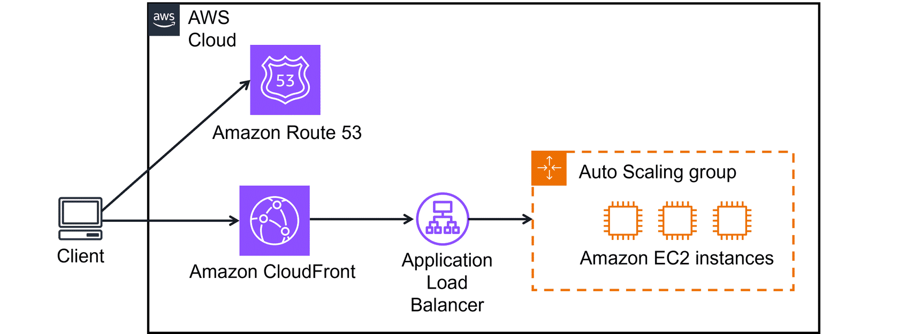

# Lecture: Global Networking

## Key Concepts

### Amazon Route 53

DNS service

### Amazon CloudFront

CDN service

### AWS Global Accelerator

Network traffic accelerator

## [Example](20260403__AWS%20Subnet%20Service%20Discovery.md)

