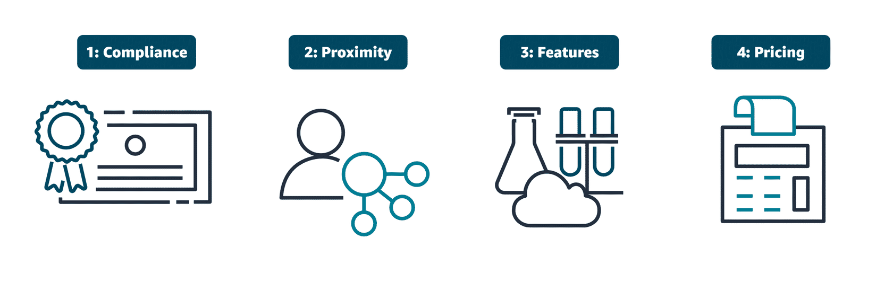

# Lecture: Going Global

## Key Concepts

### How to choose a Region

- Compliance: follow regulatory requirements and data protection laws of your industry and region.
- Promixity: choose a region close to your users to reduce latency and improve performance.
- Features: some AWS services and features are only available in specific regions, so check the AWS Regional Services List to ensure the services you need are available in your chosen region.
- Pricing: AWS pricing can vary by region, so consider the cost implications of your choice.

### Amazon CloudFront

Amazon CloudFront is a content delivery network (CDN) service that securely delivers data, videos, applications, and APIs to customers globally with low latency and high transfer speeds.

CloudFront uses **Edge locations**, which are part of our worldwide Amazon Global Edge Network. These edge locations are actually separate from Regions and are specifically designed to accelerate content delivery. Edge locations host other AWS services, like AWS Global Accelerator and Amazon Route 53. Route 53 is a Domain Name System, or DNS, that routes end users to internet applications.

### CloudFormation

CloudFormation is a service that helps you model and set up your AWS resources so that you can spend less time managing those resources and more time focusing on your applications that run in AWS. With CloudFormation, you can define your infrastructure as code. You create a template that describes all the AWS resources that you want (like Amazon Elastic Compute Cloud (Amazon EC2) instances), and CloudFormation takes care of provisioning and configuring those resources for you.

CloudFormation is a Infrastructure as code (IaC) tool.
