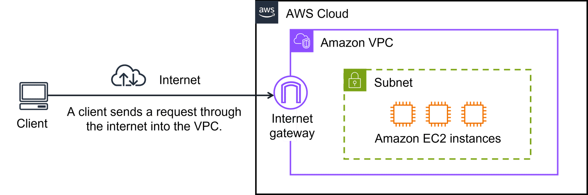
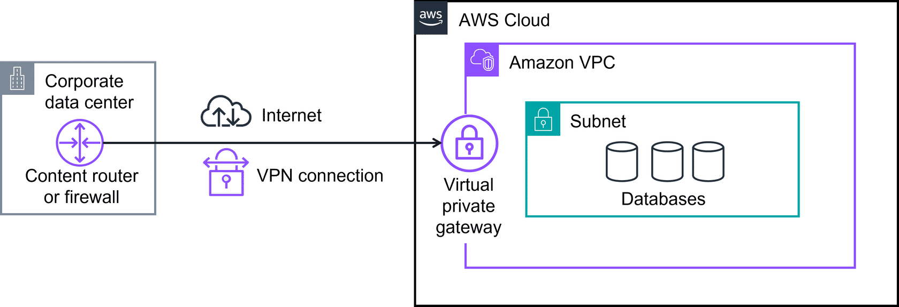

# Lecture: Introduction to Networking

## Key Concepts

### Networking

The term networking refers to interconnected devices that can exchange data and resources. Networking in the AWS Cloud consists of the infrastructure and services working together to host your applications, data, and any other resources you might need.

### Architectural Diagrams

A diagram is, simply put, a schematic or map of your network in the AWS Cloud. It can provide a visual of how users or applications access services, resources, or data.

### Amazon Virtual Private Cloud (VPC)

Amazon Virtual Private Cloud (Amazon VPC) is a service that allows you to create a logically isolated section of the AWS Cloud where you can launch AWS resources in a virtual network that you define. You have complete control over your virtual networking environment, including selection of your own IP address range, creation of subnets, and configuration of route tables and network gateways.

### Subnets

A subnet is a range of IP addresses in your VPC. You can launch AWS resources into a specified subnet. Use subnets to group instances based on security and operational needs.

### Internet Gateway

An Internet gateway is a horizontally scaled, redundant, and highly available VPC component that allows communication between instances in your VPC and the internet. It serves two purposes: to provide a target in your VPC route tables for internet-routable traffic, and to perform network address translation (NAT) for instances that have been assigned public IPv4 addresses.

### Virtual Private Gateway

A virtual private gateway is the virtual private network (VPN) endpoint on the AWS side. It provides a way for you to establish a secure, encrypted connection between your on-premises network and your virtual private cloud (VPC).

### 4 ways to connect to the AWS Cloud

- AWS Client VPN: used for remote workers to securely access AWS resources.
- AWS Site-to-Site VPN: used to connect on-premises networks to AWS.
- AWS Direct Connect: used for a dedicated network connection from your premises to AWS.
- AWS PrivateLink: used to securely access services hosted on AWS without using public IPs.
