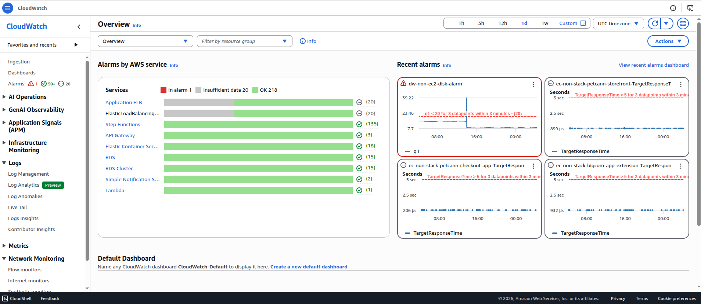

# Lecture: Monitoring

## Key Concepts

### What is Monitoring

In the AWS Cloud, monitoring is the continuous process of collecting, visualizing, and tracking the health and performance of your AWS infrastructure, services, and applications. This goal of monitoring is to help ensure optimal performance and identify potential issues.

### CloudWatch

CloudWatch monitors your AWS resources and the applications that you run on AWS in real time. With CloudWatch, you gain system-wide visibility into resource utilization, application performance, and operational health. CloudWatch does more than just monitor. It has several features that work together:

- CloudWatch metrics: CloudWatch collects metrics from all your AWS resources, applications, and services that run on AWS and on-premises servers.
- CloudWatch alarms: With CloudWatch alarms, you can define thresholds on CloudWatch metrics and send notifications or automatically make changes to the resources.
- CloudWatch dashboards: Dashboards are customizable home pages in the CloudWatch console that you can use to monitor your resources in a single view.
- CloudWatch logs: CloudWatch Logs centralize the logs from all of the systems, applications, and AWS services that you use.

### CloudTrail

CloudTrail tracks user activity and API usage in the AWS Cloud, on premises, and even with other cloud providers. CloudTrail provides a detailed history of API calls, so you can track changes and identify who made them and when. This helps you understand what actions were taken on your AWS resources.
