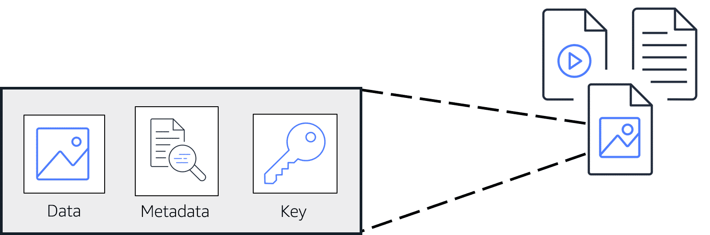
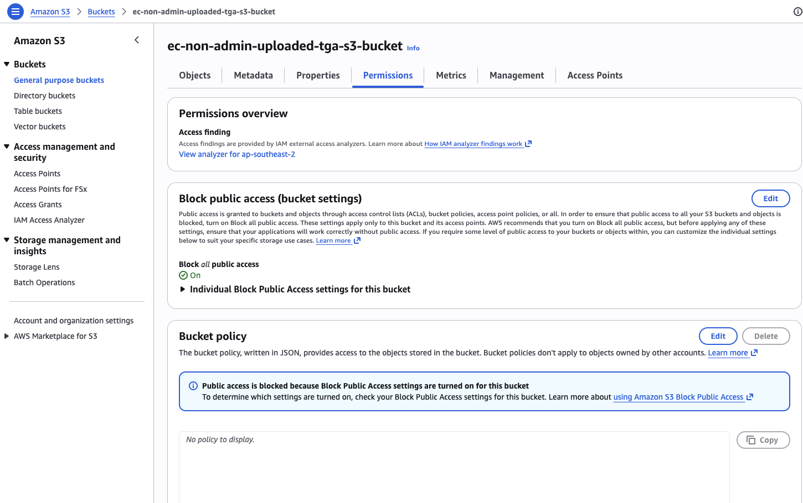
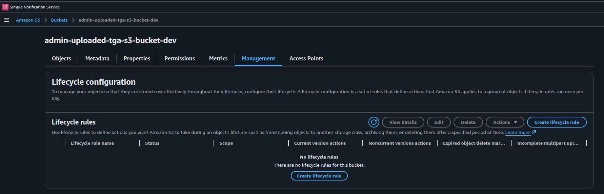
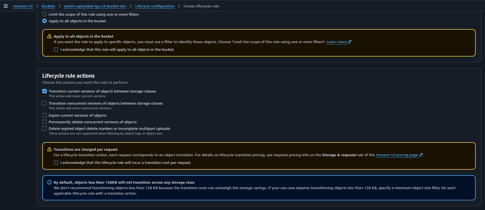

# Lecture: Object Storage (S3)

## Key Concepts

### S3 (Simple Storage Service)

Amazon S3 is an object storage service that can store unlimited amounts of data in the AWS Cloud. Object storage is particularly well-suited for handling large amounts of unstructured data, such as documents, images, and videos.

Use cases:

- Content distribution
- Hosting static websites
- Delivering media files
- Application data storage
- Archiving
- Data lakes
- Compliance-driven data retention

### S3 Objects

An object in Amazon S3 is the fundamental unit of data storage. When you upload a file to Amazon S3, it becomes an object and is stored durably across multiple facilities within your chosen Region.

Each object typically includes the data itself, metadata, and a unique identifier, or key. Objects can be of any file type, such as images, videos, documents, or application data, and can range in size from a few bytes to several terabytes.

Each Amazon S3 object is uniquely identified within a bucket by its key, which is essentially its file name. Objects also have properties like version ID, access control information, and user-defined metadata.

### S3 Buckets

An S3 bucket is a container for storing objects in Amazon S3. Buckets have a globally unique name across all of AWS, which helps to identify and organize your stored data.

Buckets serve as the basic unit for access control and can hold a virtually unlimited number of objects.

### Security and privacy management

Everything you store in Amazon S3 is private by default. You must explicitly grant permissions to access these resources. If you want your Amazon S3 data to be available to everyone on the internet, you can choose to make your buckets and objects public. To more granularly define who can do what with your Amazon S3 resources, Amazon S3 provides several security management features.

- **Bucket policies**: Amazon S3 bucket policies are resource-based policies that can only be attached to S3 buckets. An S3 bucket policy specifies which actions are allowed or denied on the bucket, in addition to every object in that bucket. S3 Block Public Access settings override bucket policies.
  

- **Identity-based policies**: Identity-based policies are attached to IAM users, groups, or roles. They specify what actions those identities can perform on which resources. For example, you can create an identity-based policy that allows a specific IAM user to read objects from a particular S3 bucket.
- **Encryption**: Amazon S3 provides encryption capabilities to protect data both at rest and in transit. These encryption features help maintain data confidentiality and comply with various security standards and regulations. These capabilities are as follows:
  - **Encryption at rest**: Secures data stored in S3 buckets, preventing unauthorized access to stored objects.
  - **Encryption in transit**: Safeguards data traveling to and from Amazon S3, maintaining secure communication between clients and the service.

### Storage classes

| Storage Class                  | Best For                                      | Use Case Example                            | Access Speed             | Availability Zones     | Retrieval Cost  | Min Storage Duration | Cost Level 💰 |
| ------------------------------ | --------------------------------------------- | ------------------------------------------- | ------------------------ | ---------------------- | --------------- | -------------------- | ------------- |
| **S3 Standard**                | Frequently accessed data                      | Web apps, content delivery, active data     | Milliseconds             | Multi-AZ               | No              | None                 | High          |
| **S3 Intelligent-Tiering**     | Unknown/changing access patterns              | Data lakes, user uploads, analytics data    | Milliseconds             | Multi-AZ               | No (most tiers) | None                 | Medium        |
| **S3 Standard-IA**             | Infrequent but quick access                   | Backups, disaster recovery                  | Milliseconds             | Multi-AZ               | Yes             | 30 days              | Lower         |
| **S3 One Zone-IA**             | Infrequent, non-critical data                 | Re-creatable data, secondary backups        | Milliseconds             | Single AZ              | Yes             | 30 days              | Lower         |
| **S3 Express One Zone**        | Ultra-low latency, high-performance workloads | Real-time analytics, AI/ML feature stores   | Single-digit ms / sub-ms | Single AZ              | No              | None                 | High          |
| **Glacier Instant Retrieval**  | Archive with immediate access                 | Medical images, media archives              | Milliseconds             | Multi-AZ               | Yes             | 90 days              | Low           |
| **Glacier Flexible Retrieval** | Archive with occasional access                | Backup archives, compliance data            | Minutes–Hours            | Multi-AZ               | Yes             | 90 days              | Very Low      |
| **Glacier Deep Archive**       | Long-term rarely accessed archive             | Legal records, long-term compliance storage | Hours (up to ~12h)       | Multi-AZ               | Yes             | 180 days             | Lowest        |
| **S3 on Outposts**             | Data residency / on-premises S3 needs         | Local processing, regulated workloads       | Low latency (on-prem)    | Single Outpost (local) | No              | None                 | High          |

### S3 Lifecycle

To avoid manually managing your object storage tier configurations, you can use S3 Lifecycle configurations to automate the process. When you define a lifecycle configuration for an object or group of objects, you can choose to automate between two types of actions, as follows:

- **Transition actions**: define when objects should transition to another storage class.
- **Expiration actions**: define when objects expire and should be permanently deleted.

For example, you might transition objects to S3 Standard-IA storage class 30 days after you create them. Or you might archive objects to the S3 Glacier Deep Archive storage class 1 year after creating them.

Use cases:

- **Periodic logs**: If you upload periodic logs to a bucket, your application might need them for a week or a month. After that, you might want to delete them.

- **Data that changes in access frequency**: Some documents are frequently accessed for a limited period of time. After that, they are infrequently accessed. At some point, you might not need real-time access to them. However, your organization or regulations might require you to archive them for a specific period. After that, you can delete them.

