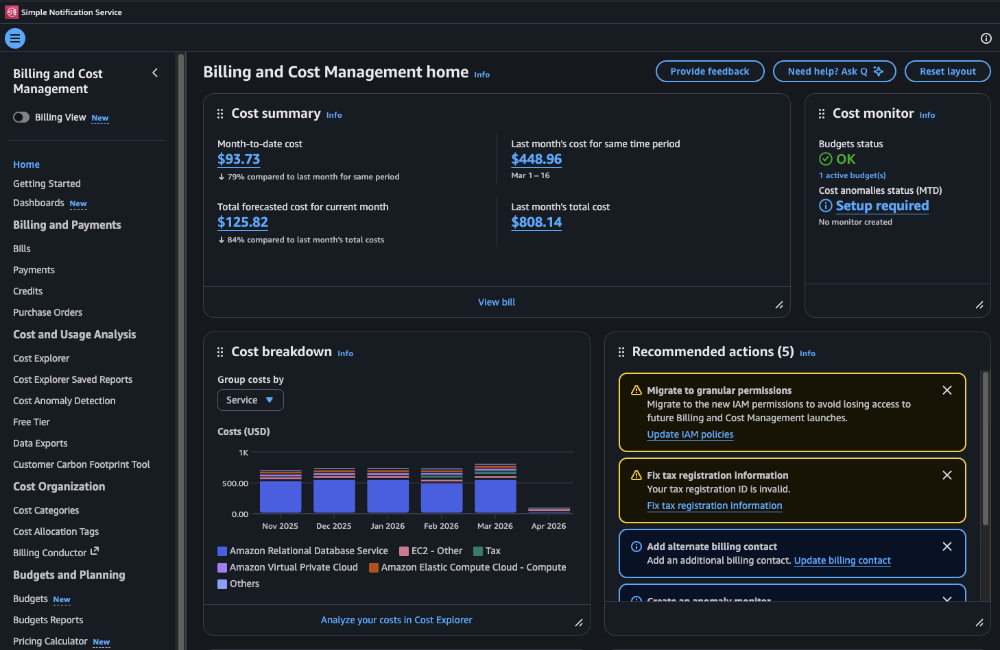

# Lecture: Pricing

## Key Concepts

### Pay as you go

With AWS, you pay only for the individual services you need, for as long as you use them, and without requiring long-term contracts or complex licensing. This means that you can start with a small amount of resources and scale up as your needs grow, without worrying about upfront costs or overprovisioning.

### Save when you commit

By committing to a certain level of usage for a certain period of time, usually 1 or 3 years, you can receive pretty significant discounts.

### Pay less by using more

With AWS, you can realize important savings as your usage increases. For some services, pricing is tiered, meaning the more you use, the less you pay.

### Driving factors of cost

- **Compute**: The amount of compute resources you use, such as the number of virtual machines, the amount of storage, and the amount of data transfer.
- **Storage**: The amount of data you store in AWS, as well as the type of storage you use (e.g., S3, EBS, Glacier).
- **Data Transfer**: In most cases, there is no charge for inbound data transfer or for data transfer between AWS services within the same Region. There are some exceptions, so be sure to verify data transfer rates before beginning. Outbound data transfer is aggregated across services and then charged at the outbound data transfer rate. The more data you transfer, the less you pay per gigabyte. For data storage and transfer, you typically pay per gigabyte.

### Billing and Cost Management Service

AWS provides a Billing and Cost Management service that allows you to view and manage your AWS costs and usage. You can use this service to set up billing alerts, view detailed billing reports, and manage your payment methods.

