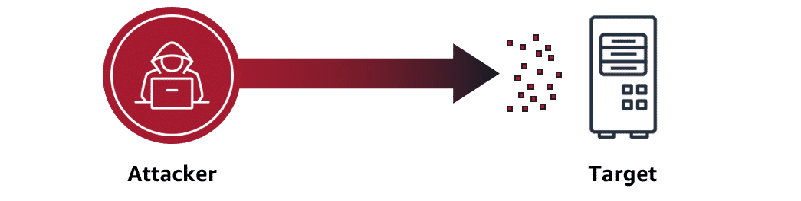

# Lecture: Protect Network and Applications

## Key Concepts

### DoS attacks

In a denial of service attack, an attacker floods a web application with excessive network traffic. Legitimate customer requests are denied if the web application becomes overloaded and can no longer respond.

### DDoS attacks

In a distributed denial of service (DDoS) attack, an attacker can use multiple infected computers (called zombie bots) to unknowingly send excessive traffic to a web application.

### AWS protection through infrastructure

- **Security groups**: Security groups only allow in proper request traffic. They operate at the AWS network level so they can shrug off massive attacks using the entire AWS Region's capacity.
- **Elastic Load Balancing (ELB)**: ELB handles traffic first before handing it off, so your frontend server is not overwhelmed. Like security groups, it runs at the Region level.
- **AWS Regions**: The enormous capacity of Regions makes them extremely difficult to overwhelm. It would be massively expensive to achieve.

### AWS Shield

AWS Shield Standard is designed to automatically protect AWS customers from the most common, frequently occurring types of DDoS attacks at no cost. It uses a variety of analysis techniques to detect and mitigate incoming malicious network traffic in real time.

### AWS WAF (Web Application Firewall)

AWS WAF is a web application firewall that lets you monitor and manage web requests that are forwarded to protected AWS resources. With AWS WAF, you can protect resources such as Amazon CloudFront distributions, Amazon API Gateway REST APIs, Application Load Balancers, and AWS AppSync GraphQL APIs. You can use AWS WAF to inspect web requests for matches to conditions that you specify, such as the IP address that the requests originate from, the value of a specific request component, or the rate at which requests are being sent. AWS WAF can manage matching requests in a variety of ways, including counting them, blocking or allowing them, or sending challenges like CAPTCHA puzzles to the client user or browser.
