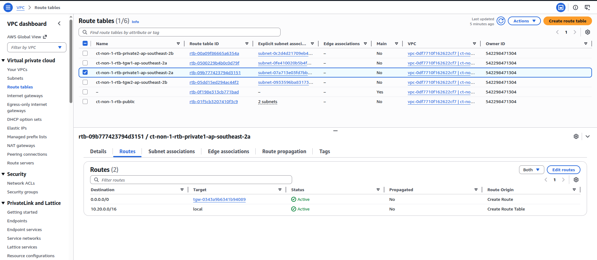

# Lecture: Subnets, Security Groups, and Network ACLs

## Key Concepts

### Subnets

- Public subnets contain resources that need to be accessible by the public, such as an online store’s website.
- Private subnets contain resources that should be accessible only through your private network, such as a database that contains customers’ personal information and order histories.

### Network traffic in a VPC

When a customer requests data from an application hosted in the AWS Cloud, this request is sent as a packet. A packet is a unit of data sent over the internet or a network.

It enters into a VPC through an internet gateway. Before a packet can enter into a subnet or exit from a subnet, it will run into several checks for permissions, one being a network ACL associated with the subnet the packet is being routed to. The permissions defined by the network ACLs indicate what is allowed or denied. It is based on who sent the packet and how the packet is trying to communicate with the resources in a subnet.

### Network Access Control Lists (ACLs)

A network ACL is a virtual firewall that controls inbound and outbound traffic at the subnet level.

Each AWS account includes a default network ACL. When configuring your VPC, you can use your account’s default network ACL or create custom network ACLs.

Default: allows all inbound and outbound traffic.
Custom: all inbound and outbound traffic is denied until you add rules to specify which traffic to allow. Additionally, all network ACLs have an explicit deny rule.

Network ACLs perform **stateless** packet filtering. They remember nothing and check packets that cross the subnet border each way: inbound and outbound.

### Security Groups

After a packet has entered a subnet, it must have its permissions evaluated for resources within the subnet, such as Amazon EC2 instances. A security group is the VPC component that checks packet permissions for an Amazon EC2 instance. It is a virtual firewall that controls inbound and outbound traffic for specific AWS resources, like Amazon EC2 instances.

Default: allows all outbound traffic and denies all inbound traffic.
Custom: you can add custom rules to configure which traffic should be allowed. Any other traffic would then be denied.

Security groups perform stateful packet filtering. They remember previous decisions made for incoming packets.

Consider the same example of sending a request out from an Amazon EC2 instance to the internet. When a packet response for that request returns to the instance, the security group remembers your previous request. The security group allows the response to proceed, regardless of inbound security group rules.

### Route tables

A route table is a set of rules, called routes, that are used to determine where network traffic from your subnet or gateway is directed. Each subnet in your VPC must be associated with a route table, which controls the routing for the subnet. Each route in a route table specifies a destination and a target. The destination is the range of IP addresses where you want to send the traffic, and the target is the gateway, network interface, or instance that you want to send the traffic to.

When a packet matches the destination of a route, the packet is forwarded to the target specified in that route. If there are multiple routes that match the destination of a packet, the most specific route is used. If there are no routes that match the destination of a packet, the packet is dropped.

Example:

- Destination 10.20.0.0/16, target local means if the destination IP address of a packet is within the range of 10.20.0.0/16, the packet will be routed locally within the VPC.
- Destination 0.0.0.0/0, target igw-12345678 means if the destination IP address of a packet is any IP address not covered by other routes, the packet will be routed to the internet gateway with the ID igw-12345678.

## Summary

| Feature        | Security Groups                                                       | Network ACLs                                                 |
| -------------- | --------------------------------------------------------------------- | ------------------------------------------------------------ |
| Scope          | Instance level (attached to EC2 instances)                            | Subnet level (associated with subnets)                       |
| State          | Stateful (remembers state)                                            | Stateless (doesn't remember state)                           |
| Rule types     | Only allow type rules                                                 | Both allow and deny type rules                               |
| Return traffic | Return traffic is automatically allowed if inbound traffic is allowed | Return traffic must be implicitly allowed in both directions |
| Uses           | Fine-grained control of traffic for individual EC2 instances          | Broad control of traffic in and out of subnets               |

Network ACLs and security groups are part of `Network traffic protection`, which is your responsibility in the AWS Shared Responsibility Model.
