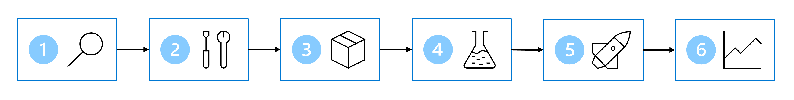

# Lecture: ML in Azure

## Overview

Learn how to design an end-to-end machine learning solution with Microsoft Azure that can be used in an enterprise setting. This lecture covers the complete ML lifecycle using six key steps:

### The ML Lifecycle: Six Core Steps

1. **Define the problem** – Clarify what the model should predict and define success criteria
2. **Get the data** – Identify and access data sources
3. **Prepare the data** – Explore, clean, and transform data for modeling
4. **Train the model** – Select algorithms and optimize hyperparameters
5. **Integrate the model** – Deploy the model to an endpoint for predictions
6. **Monitor the model** – Track performance and detect issues in production

---

## Step 1: Define the Problem

The foundation of any ML project is a clear understanding of the business problem and success criteria.

### Identify the Output Type

Determine what your model needs to predict:

| Output Type       | Use Case                                                        | Model Type              |
| ----------------- | --------------------------------------------------------------- | ----------------------- |
| **Numeric Value** | Predicting continuous values (prices, temperatures, quantities) | Regression              |
| **Category**      | Predicting discrete classes (spam/not spam, customer segments)  | Classification          |
| **Time Series**   | Predicting future values based on historical trends             | Time-series Forecasting |

### Choose a Machine Learning Task

Select the appropriate ML task based on your business problem:

| Task                            | Purpose                                       | Example                |
| ------------------------------- | --------------------------------------------- | ---------------------- |
| **Classification**              | Predict a category or class                   | Email spam detection   |
| **Regression**                  | Predict a numeric value                       | House price prediction |
| **Time-series Forecasting**     | Predict future values from historical data    | Stock price trends     |
| **Computer Vision**             | Analyze and classify images or detect objects | Medical image analysis |
| **Natural Language Processing** | Extract insights and patterns from text       | Sentiment analysis     |

### Define Success Criteria

Establish clear metrics to evaluate model performance:

- **Accuracy** – Overall correctness of predictions
- **Precision** – Accuracy of positive predictions
- **Recall** – Coverage of actual positive cases
- **F1-score** – Balanced measure of precision and recall
- **Root Mean Squared Error (RMSE)** – Measure of prediction error for regression

---

## Step 2: Acquire and Prepare Data

Data is the foundation of machine learning. This step involves identifying data sources and preparing them for model training.

### Identify Data Sources

Before acquiring data, consider:

- What data sources are available? (databases, IoT devices, APIs, data warehouses)
- What is the volume and quality of data?
- How will data be accessed and served?

### Execute the ETL/ELT Process

The Extract, Transform, Load (ETL) or Extract, Load, Transform (ELT) process moves and prepares data:

| Stage         | Purpose               | Details                                                  |
| ------------- | --------------------- | -------------------------------------------------------- |
| **Extract**   | Retrieve raw data     | Pull data from CRM systems, IoT devices, databases, APIs |
| **Transform** | Clean and format data | Validate, normalize, and prepare data for ML use         |
| **Load**      | Store processed data  | Place data in a serving layer for model training         |
| **Serve**     | Provide data access   | Make prepared data available for training and inference  |

### Implement a Data Ingestion Pipeline

Automated data pipelines handle continuous data movement and transformation:

**Key Characteristics:**

- **Automation** – Moves and transforms data without manual intervention
- **Scheduling** – Can run on a schedule or trigger manually
- **Azure Tools** – Azure Synapse Analytics, Azure Databricks, Azure Machine Learning

**Typical Implementation:**

1. **Extract** raw data from sources (CRM, IoT devices, databases)
2. **Transform** using Azure Synapse Analytics for data processing
3. **Store** prepared data in Azure Blob Storage
4. **Train** by loading data into Azure Machine Learning

---

## Step 3: Train the Model

Model training involves selecting algorithms, configuring hyperparameters, and evaluating performance. Azure provides tools to support the entire training workflow.

### Choose a Machine Learning Service

When selecting a machine learning platform, evaluate:

| Factor              | Considerations                                            |
| ------------------- | --------------------------------------------------------- |
| **Model Type**      | Classical ML, deep learning, large language models, etc.  |
| **Control Level**   | Full custom control vs. managed/automated solutions       |
| **Time Investment** | Resources and timeline available for development          |
| **Integration**     | Existing Azure services and organizational infrastructure |
| **Preferences**     | Preferred programming languages and frameworks            |

### Azure Machine Learning Overview

Azure Machine Learning is a cloud service that supports the entire ML lifecycle, from data preparation through model deployment and monitoring.

**Target Users:**

- Data scientists developing and experimenting with models
- ML engineers productionizing models at scale
- DevOps professionals managing ML infrastructure

### Core Capabilities

Azure ML supports these essential tasks:

1. **Data Exploration & Preparation** – Explore and prepare data for modeling
2. **Model Training & Evaluation** – Train models using various algorithms and frameworks
3. **Model Registration & Management** – Version and track trained models
4. **Production Deployment** – Deploy models to real-world endpoints
5. **Responsible AI** – Implement explainability, fairness, and ethical AI practices

### Key Features for Model Training

Azure Machine Learning provides these powerful capabilities:

| Feature                            | Description                                                     |
| ---------------------------------- | --------------------------------------------------------------- |
| **Centralized Dataset Management** | Store, version, and manage datasets in one location             |
| **On-Demand Compute**              | Scale compute resources up or down based on training needs      |
| **Automated ML (AutoML)**          | Automatically test algorithms and hyperparameters at scale      |
| **Visual Pipeline Tools**          | Drag-and-drop interface for designing training workflows        |
| **Framework Integrations**         | Support for MLflow, TensorFlow, PyTorch, scikit-learn, and more |
| **Responsible AI Tools**           | Built-in explainability and fairness assessment capabilities    |

---

## Step 4: Integrate the Model (Deployment)

Once trained and validated, the model must be deployed to an endpoint where it can generate predictions on new data.

### Deployment Options

Choose a deployment strategy based on your use case:

#### Real-Time Predictions

**Use Case:** Model scores new data as it arrives (e.g., product recommendations on a website)

**How It Works:**

- Model deployed to a persistent endpoint
- Immediate predictions on individual requests
- Low latency required

**Infrastructure Options:**

- Azure Container Instances (ACI) – Lightweight, simple deployments
- Azure Kubernetes Service (AKS) – Enterprise-scale, high throughput

**Cost Considerations:**

- Compute must always be running
- Continuous cost while deployed
- **Trade-off:** Low latency vs. higher steady cost

#### Batch Predictions

**Use Case:** Score large datasets periodically (e.g., customer churn analysis monthly)

**How It Works:**

- Model processes multiple records in parallel
- Results saved to file or database
- Higher throughput, asynchronous processing

**Infrastructure:**

- Compute clusters that scale across multiple nodes
- Provision on-demand, scale to zero when idle
- Much lower idle cost

**Cost Considerations:**

- Clusters scale down to zero when not in use
- Efficient for batch processing
- **Trade-off:** Higher throughput and lower cost, but not suitable for low-latency needs

### Configure the Endpoint

After deployment:

1. **Set up API access** – Allow applications to call the model endpoint
2. **Configure authentication** – Secure access with keys or managed identity
3. **Monitor performance** – Track latency, throughput, and errors

---

## Step 5: Monitor the Model

After deployment, continuous monitoring ensures the model maintains performance and detects issues early.

### Monitor Key Metrics

Track these indicators in production:

- **Prediction Accuracy** – Verify accuracy remains consistent over time
- **Data Drift** – Detect when incoming data distribution changes
- **Performance Degradation** – Identify when model performance declines
- **Latency & Throughput** – Ensure endpoint meets response time requirements
- **Error Rates** – Track failed predictions or API errors

### Respond to Issues

When problems are detected:

- **Retrain the model** – Update with new data when performance drops
- **Investigate data drift** – Understand why incoming data has changed
- **Update features** – Modify feature engineering if data distribution shifts
- **Roll back** – Deploy previous model version if critical issues occur

---

## Resources

- [Module](https://learn.microsoft.com/en-us/training/modules/design-machine-learning-model-training-solution/)
