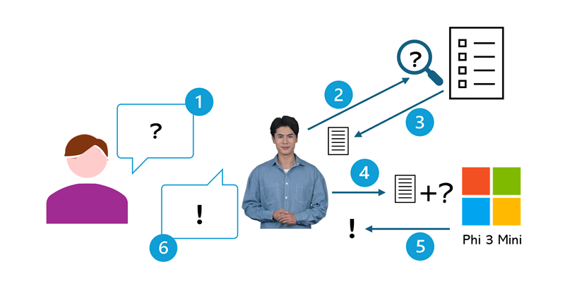

# Lecture: Explore Simple Agent

## Overview

Explore the architecture and functionality of a simple AI agent.

## Key Concepts

### RAG

**Retrieval-Augmented Generation (RAG)** is a pattern in which the agent _retrieves_ contextual information from a knowledge store, uses it to _augment_ the original prompt, which is sent to a language model to _generate_ a response. This approach helps improve the relevance and accuracy of the generated output by grounding it in specific, up-to-date information.

## Detailed Notes

At a high level, a simple AI agent using RAG consists of the following steps:

1. **User Input**: The user provides a query or prompt to the agent.
2. **Extract Keywords**: The agent processes the input to extract relevant keywords or phrases that will be used to search the knowledge base.
3. **Retrieve Context**: Using the extracted keywords, the agent queries a knowledge store (such as a vector database) to retrieve relevant documents or information.
4. **Augment Prompt**: The agent combines the original user input with the retrieved context to create an augmented prompt.
5. **Generate Response**: The augmented prompt is sent to a language model (like GPT-4), which generates a response based on the enriched information.
6. **Return Output**: The agent returns the generated response to the user.

## Resources

- [Lecture](https://microsoftlearning.github.io/mslearn-ai-concepts/Instructions/exercises/00-explore-agent.html)
