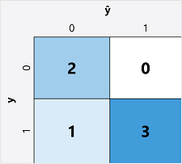
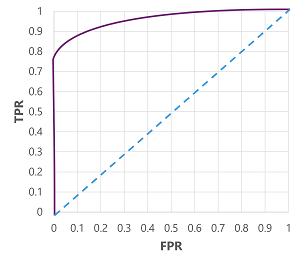

# Lecture: Binary Classification

## Overview

Binary classification algorithms are used to train a model that predicts one of two possible labels for a single class. Essentially, predicting true or false. In most real scenarios, the data observations used to train and validate the model consist of multiple feature (x) values and a y value that is either 1 or 0.

## Detailed Notes

To train the model, we'll use an algorithm to fit the training data to a function that calculates the _probability_ of the class label being true (in other words, that the patient has diabetes). Probability is measured as a value between 0.0 and 1.0, such that the total probability for all possible classes is 1.0. So for example, if the probability of a patient having diabetes is 0.7, then there's a corresponding probability of 0.3 that the patient isn't diabetic.

The function produced by the algorithm describes the probability of y being true (y=1) for a given value of x. Mathematically, you can express the function like this:

f(x) = P(y=1 | x)

### Evaluation Metrics

The first step in calculating evaluation metrics for a binary classification model is usually to create a matrix of the number of correct and incorrect predictions for each possible class label - a _confusion matrix_:

- ŷ=0 and y=0: True negatives (TN)
- ŷ=1 and y=0: False positives (FP)
- ŷ=0 and y=1: False negatives (FN)
- ŷ=1 and y=1: True positives (TP)

The arrangement of the confusion matrix is such that correct (true) predictions are shown in a diagonal line from top-left to bottom-right. Often, color-intensity is used to indicate the number of predictions in each cell, so a quick glance at a model that predicts well should reveal a deeply shaded diagonal trend.

- **Accuracy**: the proportion of total predictions that were correct.

  Accuracy = (TP + TN) / (TP + TN + FP + FN)

- **Recall**: the proportion of actual positive cases that were correctly identified.

  Recall = TP / (TP + FN)

- **Precision**: the proportion of predicted positive cases that were actually positive.

  Precision = TP / (TP + FP)

- **F1 Score**: the harmonic mean of precision and recall, providing a single metric that balances both.

  F1 Score = 2 x (Precision x Recall) / (Precision + Recall)

- **ROC-AUC**: the area under the Receiver Operator Characteristic (ROC) curve, which plots the true positive rate (TPR) against the false positive rate (FPR) at various threshold settings. A higher AUC indicates better model performance.

  

  How to draw the ROC curve:
  1. **Generate Predictions**: Run your trained model on test data and get probability scores (0 to 1) for each sample, not just binary labels.

  2. **Set Threshold Values**: Start with different threshold values (0.0, 0.1, 0.2, ... 1.0). For each threshold:
  - Classify as positive (1) if probability ≥ threshold
  - Classify as negative (0) if probability < threshold
  3. **Calculate TPR and FPR** for each threshold:
  - TPR = TP / (TP + FN) — "What % of actual positives did we catch?"
  - FPR = FP / (FP + TN) — "What % of actual negatives did we misclassify?"
  4. **Plot Points**: Plot each (FPR, TPR) pair on a graph:
  - X-axis: FPR (0 to 1)
  - Y-axis: TPR (0 to 1)
  5. **Connect the Points**: Draw a smooth curve connecting all the points.

  6. **Calculate AUC**: Measure the area under the curve.

## Resources

- [Lecture](https://learn.microsoft.com/en-us/training/modules/fundamentals-machine-learning/5-binary-classification?pivots=text)
