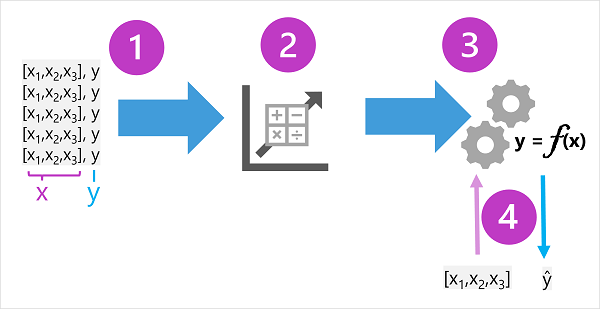

# Lecture: Machine Learning Model

### Machine Learning

Machine learning is in many ways the intersection of two disciplines - data science and software engineering. The goal of machine learning is to use data to create a predictive model that can be incorporated into a software application or service. To achieve this goal requires collaboration between data scientists who explore and prepare the data before using it to train a machine learning model, and software developers who integrate the models into applications where they're used to predict new data values (a process known as _inferencing_).

Machine learning has its origins in statistics and mathematical modeling of data. The fundamental idea of machine learning is to use data from past observations to predict unknown outcomes or values.

### Model

Fundamentally, a machine learning model is a software application that encapsulates a _function_ to calculate an output value based on one or more input values. The process of defining that function is known as _training_. After the function has been defined, you can use it to predict new values in a process called _inferencing_.

- Define function === Training
- Use function === Inferencing

### Training and Inferencing Steps

1. The training data consists of past observations. In most cases, the observations include the observed attributes or _features_ of the thing being observed, and the known value of the thing you want to train a model to predict (known as the _label_). In mathematical terms, you'll often see the features referred to using the shorthand variable name x, and the label referred to as y. Usually, an observation consists of multiple feature values, so x is actually a vector (an array with multiple values), like this: [x1,x2,x3,...].

2. An _algorithm_ is applied to the data to try to determine a relationship between the features and the label, and generalize that relationship as a calculation that can be performed on x to calculate y. The specific algorithm used depends on the kind of predictive problem you're trying to solve (more about this later), but the basic principle is to try to fit the data to a function in which the values of the features can be used to calculate the label.

3. The result of the algorithm is a model that encapsulates the calculation derived by the algorithm as a function - let's call it f. In mathematical notation: y = f(x)

4. Now that the training phase is complete, the trained model can be used for inferencing. The model is essentially a software program that encapsulates the function produced by the training process. You can input a set of feature values, and receive as an output a prediction of the corresponding label. Because the output from the model is a prediction that was calculated by the function, and not an observed value, you'll often see the output from the function shown as ŷ (which is rather delightfully verbalized as "y-hat").

## Resources

- [Lecture](https://learn.microsoft.com/en-us/training/modules/fundamentals-machine-learning/2-what-is-machine-learning?pivots=text)
