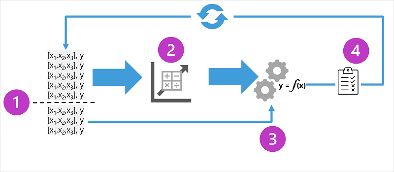

# Lecture: Regression

## Overview

Regression models are trained to predict numeric label values based on training data that includes both features and known labels.

## Detailed Notes

### Key Elements of Supervised Regression Training

1. Split the training data (randomly) to create a dataset with which to train the model while holding back a subset of the data that you'll use to validate the trained model.
2. Use an algorithm to fit the training data to a model. In the case of a regression model, use a regression algorithm such as linear regression.
3. Use the validation data you held back to test the model by predicting labels for the features.
4. Compare the known actual labels in the validation dataset to the labels that the model predicted. Then aggregate the differences between the predicted and actual label values to calculate a metric that indicates how accurately the model predicted for the validation data.

After each train, validate, and evaluate iteration, you can repeat the process with different algorithms and parameters until an acceptable evaluation metric is achieved.

### Regression evaluation metrics

There are multiple metrics you can use to evaluate the accuracy of a regression model. Common metrics include:

- Mean Absolute Error (MAE): the average absolute difference between the predicted and actual label values.
- Mean Squared Error (MSE): the average of the squared differences between the predicted and actual label values. In practical applications, the choice between MAE and MSE can depend on the specific goals of the analysis. If the goal is to minimize the average error without concern for the size of individual errors, MAE might be preferred. However, if it is crucial to penalize larger errors more heavily, MSE would be the better choice.
- Root Mean Squared Error (RMSE): the square root of the average of the squared differences between the predicted and actual label values. In practice, RMSE is often preferred over MSE when the goal is to minimize prediction errors in a way that is understandable to stakeholders. Since RMSE is in the same units as the output variable, it can be directly related to the context of the problem.
- Coefficient of determination R-squared (R²): a statistical measure that indicates the proportion of the variance in the dependent variable that is predictable from the independent variables. In the context of regression analysis, R² serves as a key indicator of how well the regression model captures the variability of the data. A higher R² value suggests that a larger proportion of the variance is accounted for by the model, indicating a better predictive capability. For instance, an R² value of 0.95 means that 95% of the variance in the dependent variable can be explained by the independent variable(s) included in the model.

## Resources

- [Lecture](https://learn.microsoft.com/en-us/training/modules/fundamentals-machine-learning/4-regression?pivots=text)
